Welcome to Jadwlha GitHub repository! This project aims to provide a comprehensive solution for users to manage their tasks, schedule, and personal profile. Our website offers a seamless experience for tracking tasks, viewing team information, and personal profile management.

Jadwlha is a web-based platform designed to help users organize their daily activities, schedule tasks efficiently, and access team information. It includes a main page with team details, a scheduling page for task management, and a user profile section.

Features
Main Page: Learn more about the team, the website's purpose, and how to use it effectively.
Scheduling Page: Users can input tasks and errands, which are then calculated to provide optimized scheduling options. Users can export these options for further use.
Profile Page: View and manage your personal profile information.
Screenshots
Here are some screenshots of our platform:

Main Page

Scheduling Page

Profile Page

Getting Started
To get started with the project, follow these steps:

1-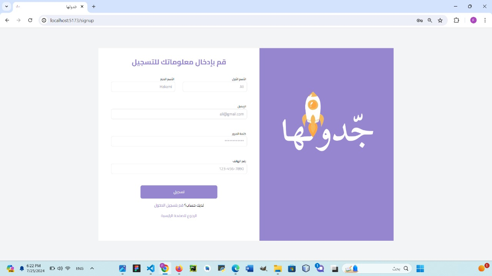
2-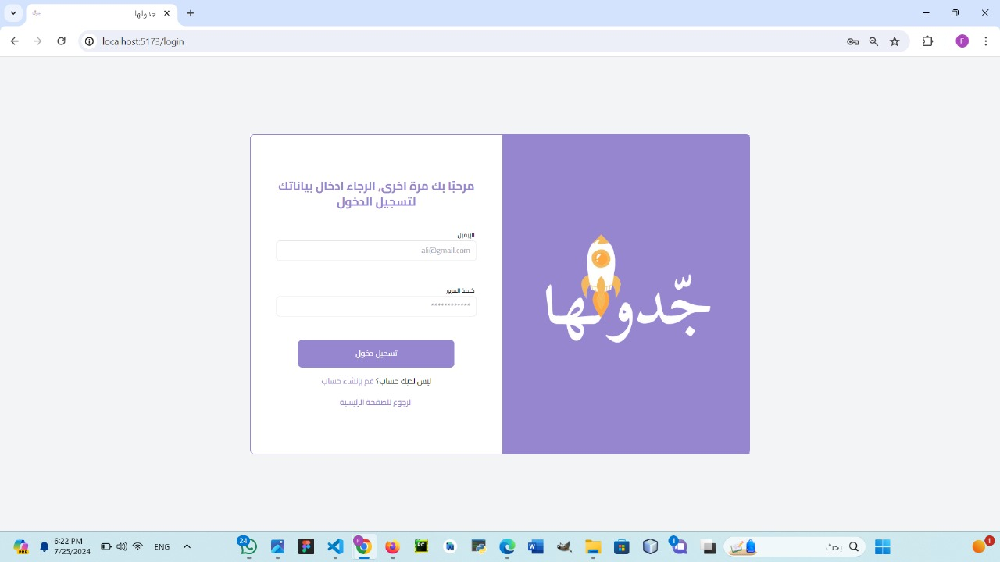
3-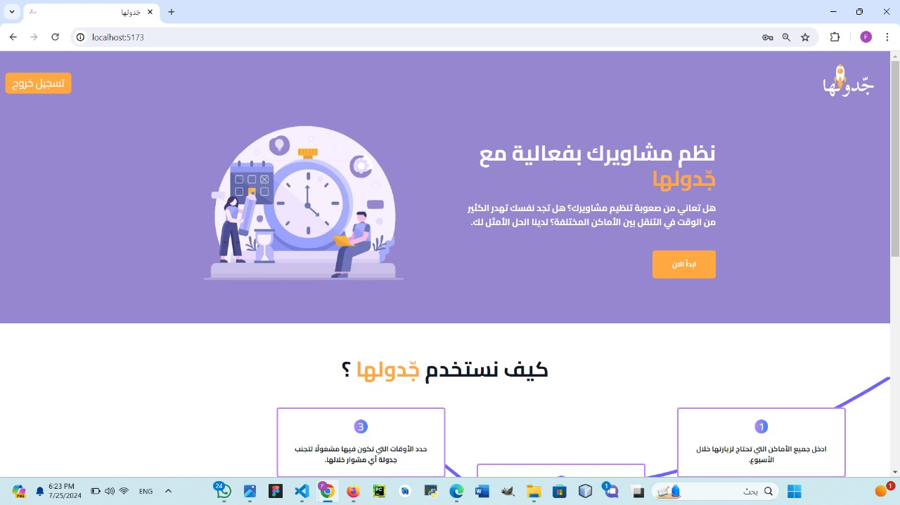
4-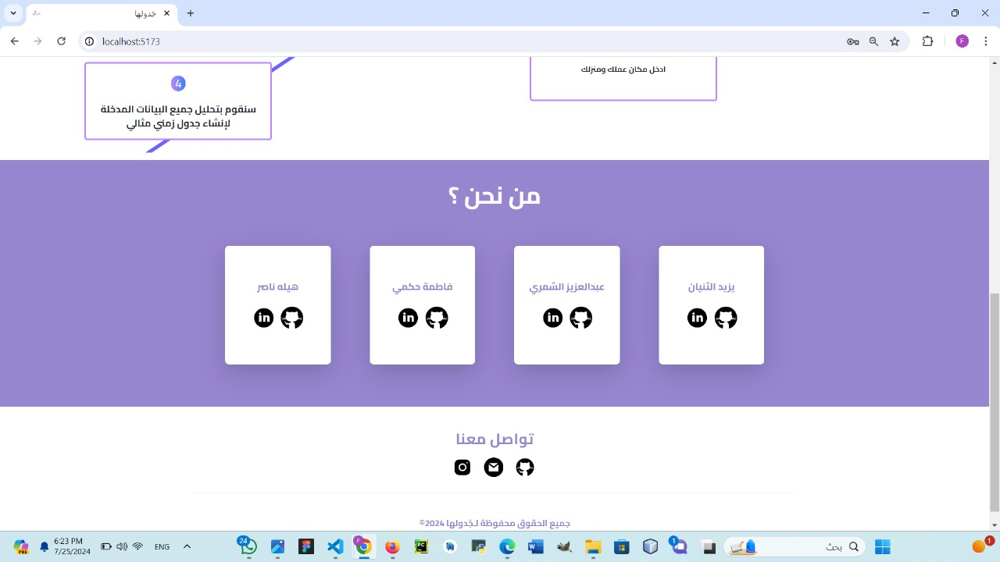
5-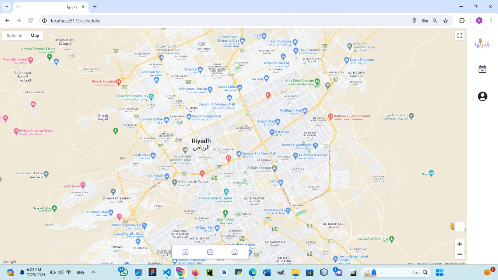
6-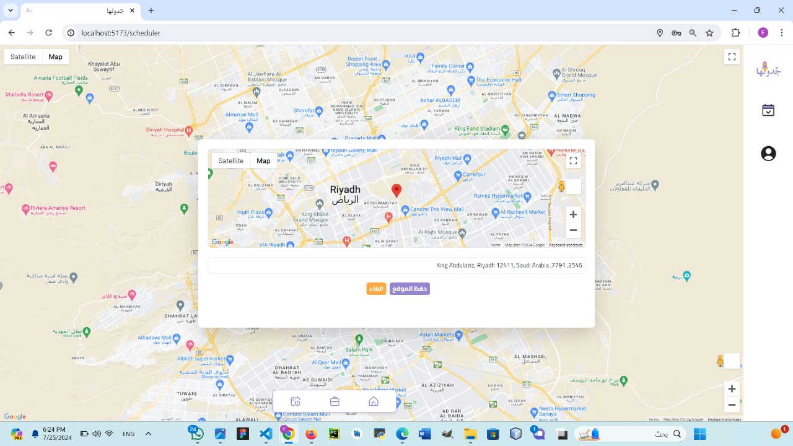
7-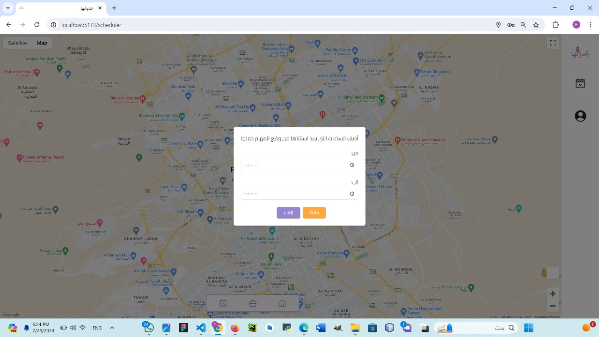
8-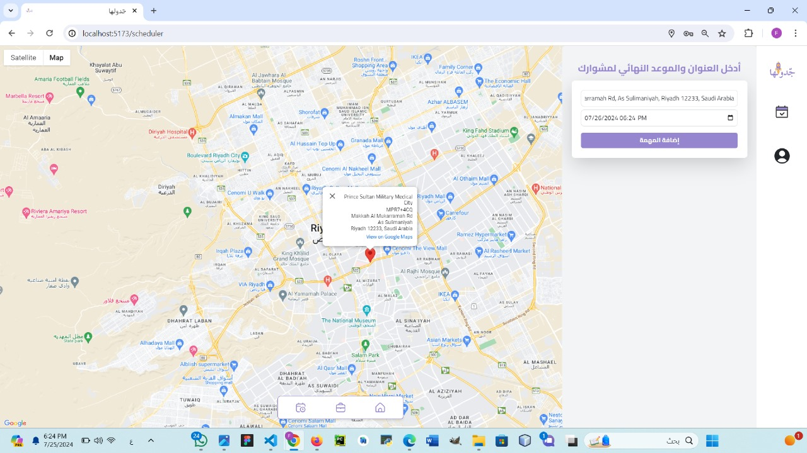
9-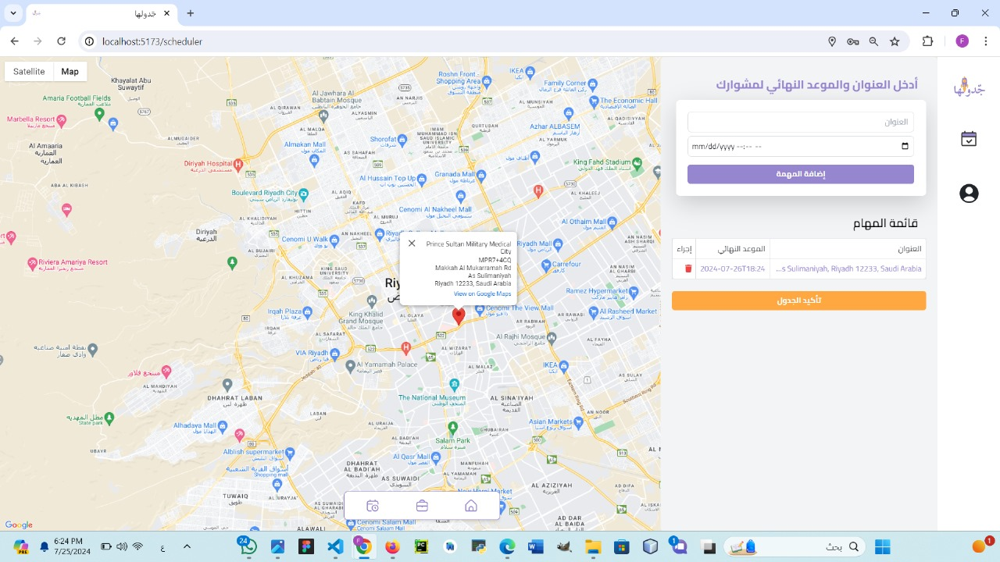
10-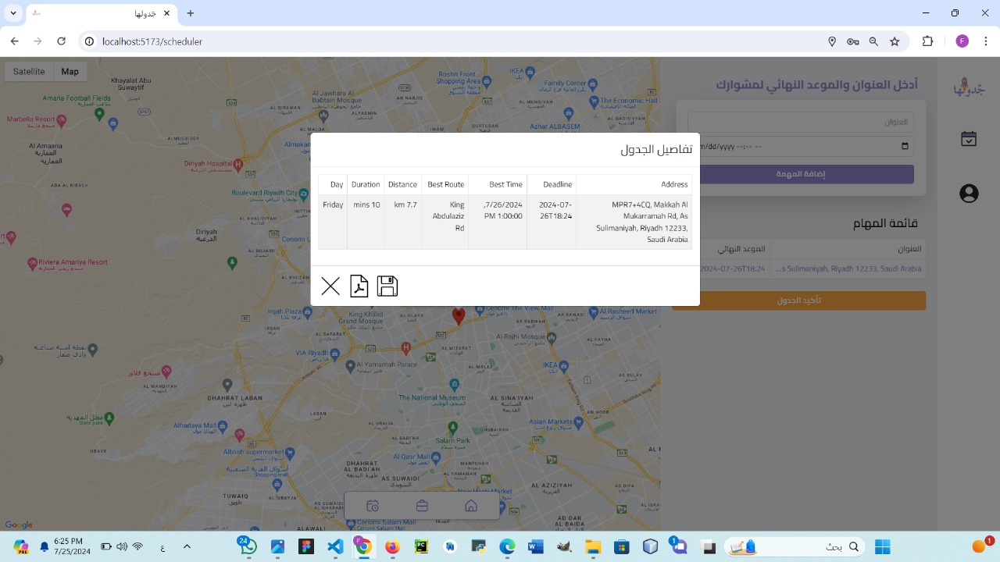
11-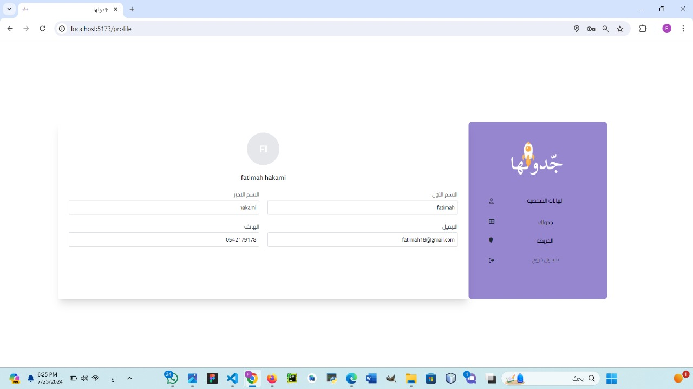
12-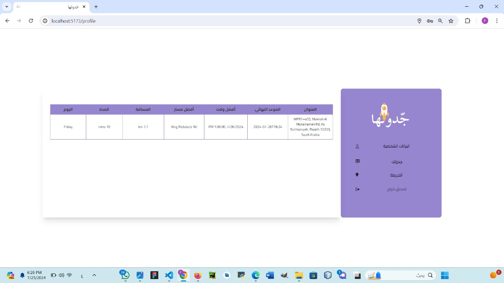
